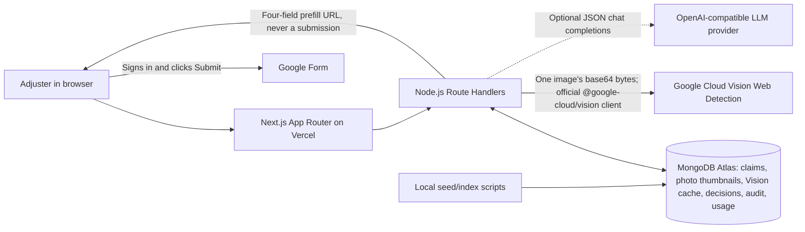

# ClaimGuard

ClaimGuard is Meridian Insurance's fictional, end-user claim-review app for BUAN 3301 (AI in Business). The team has deployed and tested the app in production: [live app](https://claim-guard-mu.vercel.app/) · [GitHub repository](https://github.com/mon030/Claim-Guard). The [deployment record](docs/DEPLOYMENT_CHECKLIST.md) separates team-reported production checks from facts verifiable in this repository.

An adjuster selects one of 18 manually mapped claims (36 instructor-supplied photos, two per claim) or enters a new claim with photos. The app checks image reuse across claims and uses Google Cloud Vision Web Detection to look for public-web matches. The deterministic guardrail returns **Auto-approve** or **Escalate**; an unavailable web check escalates rather than appearing clean. The app prepares four fields in a Google Form, but **never supplies an email or submits the Form**. A person signs in and clicks Submit. Optional LLM wording cannot change the guardrail decision, and the app works without an LLM.

## Architecture actually running



Reference JPGs are under `data/photos/`, **not** `public/`; the app serves only stored thumbnails. Browser-side ZIP extraction sends one image per lookup request. Server-side SHA-256 and dHash support exact/near-duplicate comparisons; `lib/guardrail.ts` alone makes the decision. Current threshold values in `lib/guardrail.config.ts` remain calibration placeholders (dHash distance 6; three non-stock full web matches), not proof of fraud. The stock-domain allowlist is `pexels.com`, `pixabay.com`, and `unsplash.com`.

## Local setup

Use Node.js **22.12.0 or newer** and npm. From the repository root:

```sh
npm ci
cp .env.example .env
```

On PowerShell, use `Copy-Item .env.example .env` instead of `cp` if preferred. Fill `.env` with your own service values; it is ignored by Git. Use a dedicated Atlas database user, a Cloud Vision API key, and the Google Form's real prefill entry IDs. Then:

```sh
npm run check
npm run db:indexes
npm run check-mapping
npm run seed:dry-run
npm run seed
npm run check-prefill
npm run dev
```

Open the local address printed by Next.js. `db:indexes`, mapping/seed, and prefill scripts run through `tsx --env-file=.env`; `seed` is idempotent. `npm run build` checks the production bundle. `npm run lookup -- ./photo.jpg` reports a single photo's hashes, Vision result, and cross-claim matches; `npm run validate-vision` generates the 36-photo calibration report. These live Vision operations can incur API charges. The mapping was supplied by the team after inspecting the images; no code infers claim/photo associations. See [Phase 3](docs/PHASE3.md), [Phase 4](docs/PHASE4.md), and [Phase 5](docs/PHASE5.md) for detailed workflow/API notes.

## Environment variables

**Local:** copy `.env.example` to ignored `.env`. **Production:** set the same names under Vercel Project Settings → Environment Variables, scoped to Production as appropriate. A Vercel variable change affects **new deployments only**, so redeploy afterward. Do not use `NEXT_PUBLIC_` for secrets. `lib/env.ts` validates values lazily and reports the variable name without printing secret values. Blank optional values count as absent.

| Variable | Requirement and purpose |
| --- | --- |
| `GOOGLE_VISION_API_KEY` | Required for live Web Detection; server-only Cloud Vision API key. |
| `MONGODB_URI` | Required Atlas database-user connection string (`mongodb+srv://` or `mongodb://`). URL-encode special characters in the password. |
| `MONGODB_DB` | Database name; defaults to `claimguard`. |
| `GOOGLE_FORM_URL` | Required full `https://docs.google.com/forms/.../viewform` URL. |
| `GOOGLE_FORM_ENTRY_CLAIM_ID` | Required numeric Form entry ID for Claim ID. |
| `GOOGLE_FORM_ENTRY_CLAIMANT` | Required numeric Form entry ID for Claimant Name. |
| `GOOGLE_FORM_ENTRY_LOOKUP` | Required numeric Form entry ID for lookup findings. |
| `GOOGLE_FORM_ENTRY_DECISION` | Required numeric Form entry ID for decision. |
| `LLM_API_KEY` | Optional provider key; set with both other `LLM_*` values or leave all three blank. |
| `LLM_API_BASE_URL` | Optional HTTP(S) OpenAI-compatible API base, without `/chat/completions`, query, or fragment. |
| `LLM_MODEL` | Optional model name accepted by that provider. |
| `ESCALATION_WEBHOOK_URL` | Optional HTTPS adjuster-notification endpoint; cannot point to Google Forms. |
| `DAILY_VISION_LIMIT` | Optional app-side daily paid-attempt limit; default `200`, `0` disables new paid Vision calls. |
| `DAILY_LLM_LIMIT` | Optional app-side daily LLM-call limit; default `200`, `0` disables new LLM calls. |
| `DEMO_ACCESS_CODE` | Optional shared code required in a request header for protected demo APIs. |
| `FORM_WEBHOOK_SECRET` | Optional, validated but currently **unused**; there is no Form-submission webhook route. |

The LLM client posts JSON chat completions to `{LLM_API_BASE_URL}/chat/completions` with the configured model and bearer key. Examples of compatible bases are OpenAI `https://api.openai.com/v1` and Gemini's OpenAI-compatible `https://generativelanguage.googleapis.com/v1beta/openai`; another compatible gateway can be used. Select a model that the chosen provider currently supports. With all three variables unset, the deterministic fallback path works normally. A partial group is a configuration error. Full LLM prompts are in [docs/PROMPTS.md](docs/PROMPTS.md).

## Service setup and safeguards

**MongoDB Atlas.** The app uses an Atlas free M0 cluster and the official `mongodb` driver. Create a dedicated database user with only the permissions needed on the ClaimGuard database (including creating its indexes during setup), not an Atlas administrator credential. The team set Atlas Network Access to `0.0.0.0/0` because Vercel Hobby Functions use a dynamic outbound IP range; a single-IP allowlist did not reliably include them. A restrictive entry also caused intermittent local connection failures on a university network whose public IP changed. `0.0.0.0/0` allows connection attempts from anywhere, **not** anonymous access: strong unique database credentials, narrow DB roles, TLS, secret storage, and monitoring remain essential. A static-egress/private-network option would permit a narrower list if the deployment plan later supports it. The app caches its MongoClient and retries bounded transient route operations; this hardening is separate from the resolved IP-list cause.

**Google Cloud Vision.** Enable Cloud Vision API and restrict `GOOGLE_VISION_API_KEY` at the API level to **Cloud Vision API only**. The official `@google-cloud/vision` client uses the key directly; this app does not require service-account credentials. Set a Cloud Vision quota cap in Google Cloud and a Cloud Billing budget alert appropriate to the team's budget. `DAILY_VISION_LIMIT` is an additional app-side counter, not the Google quota. A budget **alert is not a hard spending cap**. The app caches results by SHA-256 and reserves usage for each paid attempt; a cache hit does not spend another Vision call.

**Google Form.** Enable “Collect email addresses” in the Form itself. Configure the four prefill entry IDs above, run `npm run check-prefill`, and have a teammate manually confirm that the real Form opens with Claim ID, Claimant Name, lookup summary, and decision. The app deliberately omits any email entry. The audit timeline ends at “waiting for a human to sign in and click Submit.”

**Source photos.** All 36 instructor reference JPGs in `data/photos/` are currently **committed** so a teammate can reproduce contact sheets, mapping checks, and seeding. They are outside `public/` so the deployed Next.js app does not directly serve or expose the originals to crawlers; this does **not** make them private in Git. Keep repository visibility and the instructor's sharing permission in mind. Uploaded user originals are not retained in MongoDB; thumbnails/evidence and user-origin records have 14-day expiry.

## Verification and versions

`npm run check` runs strict TypeScript validation and Vitest, including the team's unchanged nine guardrail tests. `npm run build` checks the Next.js production build. The team reports an end-to-end production check; see the [retrospective deployment checklist](docs/DEPLOYMENT_CHECKLIST.md). The earlier [local full-debug report](docs/FULL_DEBUG_2026-09-25.md) is local evidence, not a substitute for production logs or cloud-console screenshots. No Google Form is submitted by automated tests or the app.

All direct versions are pinned exactly in `package.json` (with transitive versions in `package-lock.json`):

| Runtime dependencies | Exact version | Development dependencies | Exact version |
| --- | ---: | --- | ---: |
| `next` | 16.3.5 | `typescript` | 7.0.2 |
| `react`, `react-dom` | 19.3.0 | `tailwindcss`, `@tailwindcss/postcss` | 4.3.3 |
| `mongodb` | 7.6.0 | `daisyui` | 5.7.43 |
| `@google-cloud/vision` | 6.1.0 | `vitest` | 5.0.1 |
| `sharp` | 0.35.4 | `vite` | 8.3.0 |
| `fflate` | 0.8.3 | `tsx` | 4.23.15 |
| `mammoth` | 1.12.3 | `@types/node` | 26.6.2 |
| `zod` | 4.6.5 | `@types/react`, `@types/react-dom` | 19.3.0 |
| `p-retry` | 8.0.1 |  |  |
| `downshift` | 9.4.0 |  |  |

Platform/security references: [Vercel environment variables](https://vercel.com/docs/environment-variables), [Vercel outbound IPs](https://vercel.com/kb/guide/how-to-allowlist-deployment-ip-address), [Atlas IP access lists](https://www.mongodb.com/docs/atlas/security/add-ip-address-to-list/), [Google API-key restrictions](https://cloud.google.com/docs/authentication/api-keys), [Vision quotas](https://cloud.google.com/vision/quotas), and [Billing budget alerts](https://cloud.google.com/billing/docs/how-to/budgets).
