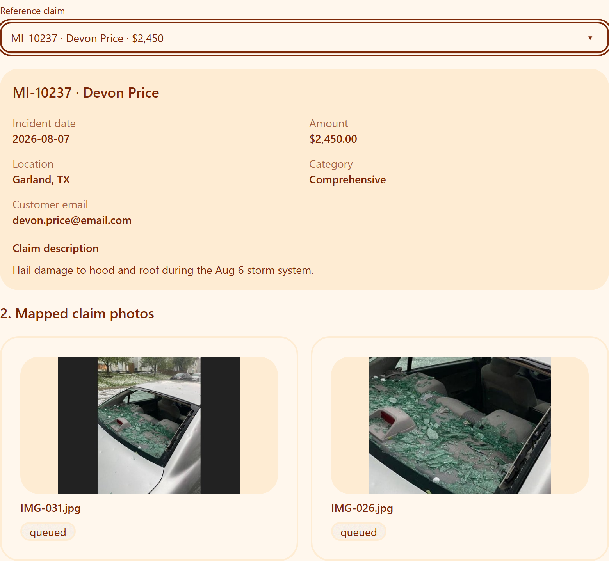
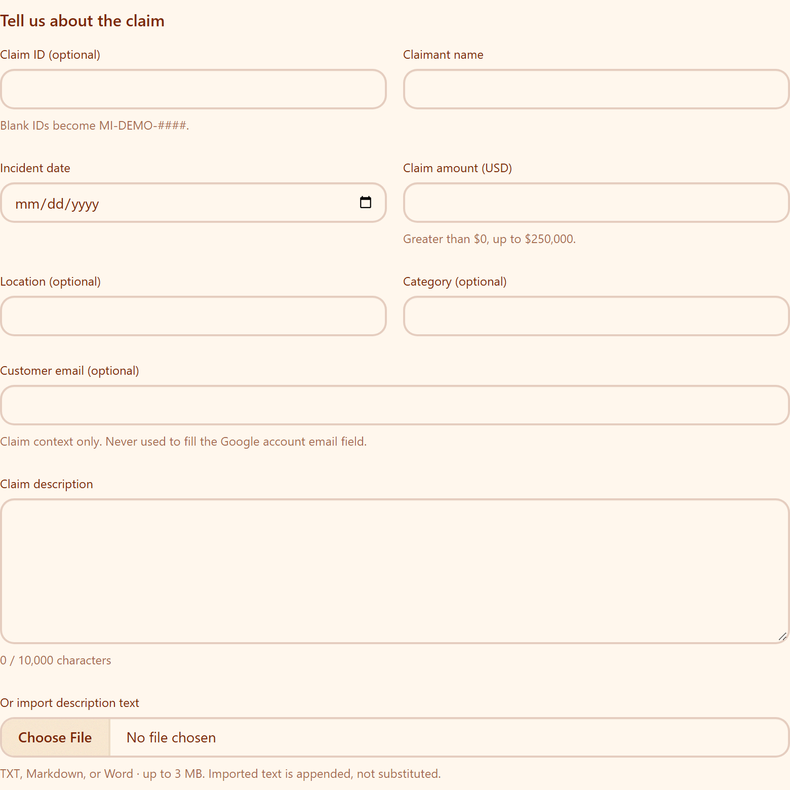
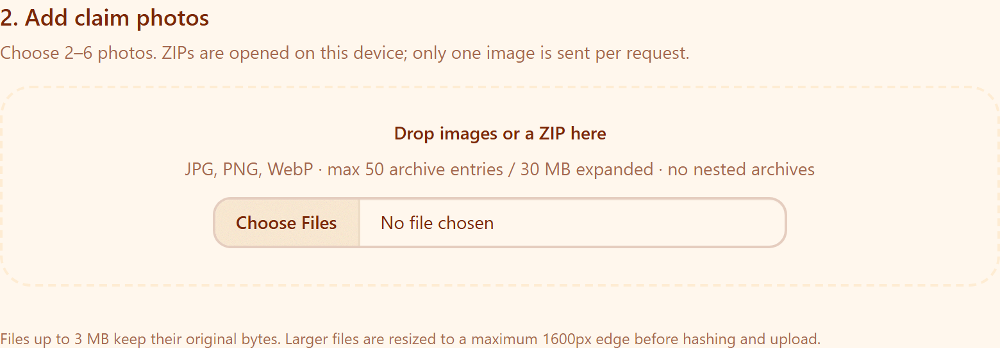
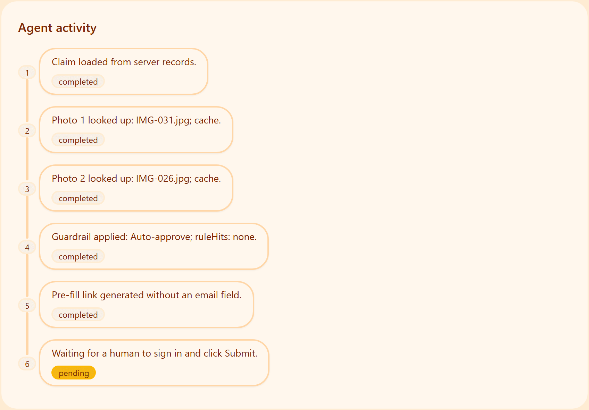
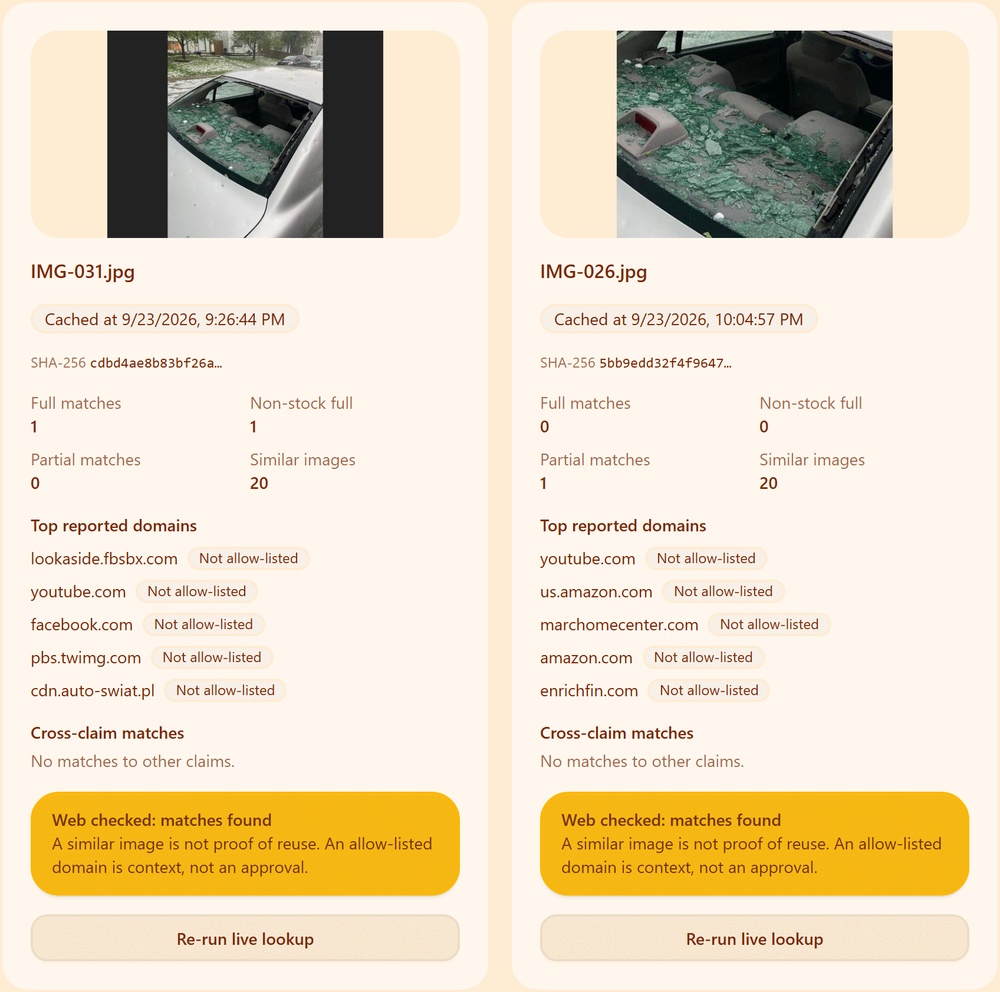
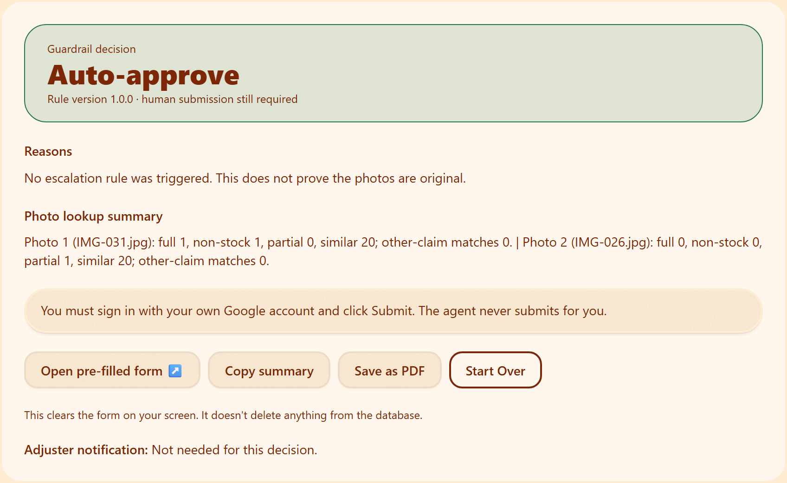
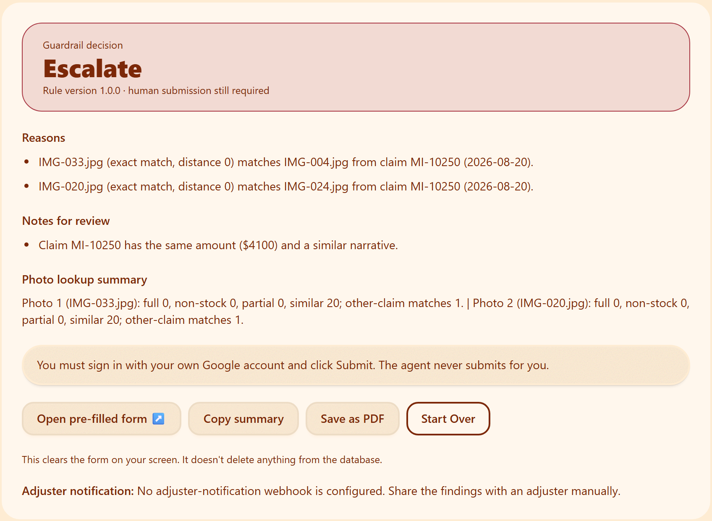
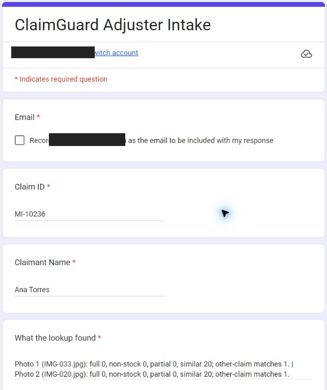
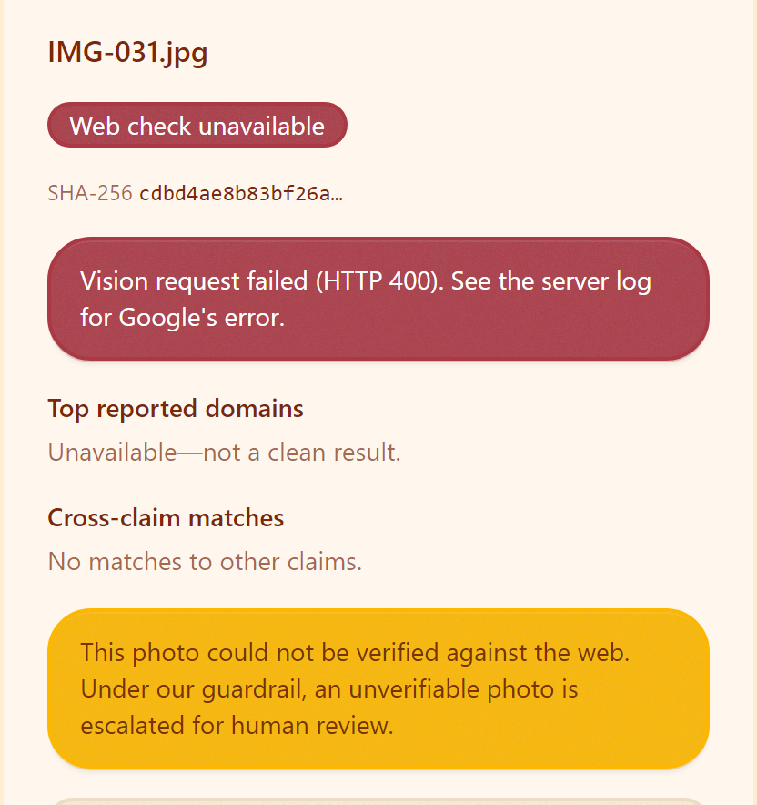
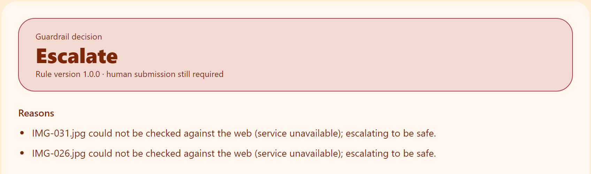

# ClaimGuard project requirements and interface screenshots

BUAN 3301 · AI in Business · Meridian Insurance (fictional)

## Purpose and scope

ClaimGuard is a single-page, end-user claim-review application, not an administrator dashboard. A reviewer selects one of 18 instructor-provided claims whose two reference photos were mapped by the team, or enters a new claim with photos. The app checks photo reuse across claims and searches for public-web matches with Google Cloud Vision Web Detection. A deterministic guardrail returns **Auto-approve**, **Escalate**, or **Blocked**. A match is a reason for review, not proof of fraud. Meridian Insurance is fictional and the app is a university-course prototype.

The application prepares a Google Form link with claim ID, claimant, photo-lookup summary, and decision. The app does not provide an email value or submit the Form. The Form currently collects **Verified** email addresses, requiring the respondent to sign in to Google; the person then clicks Submit.

## End-to-end user flow

1. Choose a mapped reference claim, or enter a new claim's factual fields and description.
2. Review the reference claim's two mapped thumbnails, or add two to six new images by picker, drag-and-drop, or ZIP.
3. Run a separate lookup for each photo. The server checks cross-claim reuse and Web Detection, reporting successful matches, a successful zero-match result, or an unavailable web check distinctly.
4. The server reloads stored evidence, applies the guardrail, records an activity timeline, and displays photo evidence and the decision.
5. Open the four-field pre-filled Form. A real person signs in with a Google account and clicks Submit; ClaimGuard cannot perform that step.

## Functional requirements

The IDs below provide a concise demo and review checklist. “Implementation anchor” points to the checked-in code; the external Form setting is identified separately.

| ID | Requirement and observable behavior | Implementation anchor |
| --- | --- | --- |
| R1 | The team's mapping assigns exactly two distinct reference JPGs to each of 18 claims and uses all 36 files once. The validator rejects missing, duplicate, or unknown assignments; no model guesses a mapping. | `data/mapping.json`; `lib/dataset.ts` |
| R2 | The single-column existing-claim combobox filters by claim ID or claimant name, supports keyboard or click selection, and disables unmapped entries. A selection shows incident facts, narrative, customer email, and two thumbnail previews. | `components/claim-picker.tsx`; `components/claim-guard-app.tsx`; `app/api/claims/route.ts` |
| R3 | A new claim requires claimant, incident date, description, and a positive USD amount no greater than $250,000. A blank claim ID is generated as `MI-DEMO-####`; location, category, and customer email are optional. TXT, MD, and DOCX description text can be appended. | `components/claim-fields.tsx`; `lib/claim-validation.ts`; `app/api/claims/route.ts`; `lib/client/files.ts` |
| R4 | A new claim uses two to six JPEG, PNG, or WebP photos. Client-side ZIP extraction ignores directories/junk/non-images, permits at most 50 entries and 30 MB expanded, and rejects nested archives. Users remove extras themselves. Each lookup sends one image, with a 4,000,000-byte server cap. | `components/photo-uploader.tsx`; `lib/client/files.ts`; `lib/api/upload.ts` |
| R5 | Web Detection receives base64 image bytes through the official Google client and distinguishes full, partial, and visually similar results. SHA-256 caching can avoid a repeat paid lookup. **A genuine successful zero-match Vision response has status `ok` with zero matches, never `unavailable`. Conversely, a failed Vision check returned as lookup evidence has status `unavailable`, never a fabricated clean zero; an HTTP/database failure stops the decision and shows an error instead.** A Live badge or cached timestamp identifies the result source. | `lib/vision.ts`; `lib/lookup.ts`; `app/api/lookup/route.ts`; `components/evidence-card.tsx` |
| R6 | Cross-claim reuse is exact when SHA-256 hashes match and near when 64-bit dHash distance is at most the current cutoff of 6. A reported match shows the other claim, claimant when available, date, filename, type, and distance. | `lib/hash.ts`; `lib/lookup.ts`; `lib/guardrail.config.ts`; `components/evidence-card.tsx` |
| R7 | The server—not browser-supplied evidence—rebuilds a `ClaimEvidence` value and calls the deterministic guardrail. Fewer than two photos yield Blocked with no Form link; cross-claim reuse, qualifying non-stock full web matches, or an unavailable web check can escalate. Narrative similarity alone adds context, not escalation. | `app/api/decide/route.ts`; `lib/guardrail.ts` |
| R8 | The result area shows an agent-activity timeline, a card per photo, web and cross-claim evidence, a decision banner, reasons/notes, optional adjuster-notification status, a live recheck action, and the human-only Form handoff. | `components/results.tsx`; `components/evidence-card.tsx`; `app/api/decide/route.ts` |
| R9 | The current Google Form has **Collect email addresses → Verified** selected; its Settings page states that respondents must sign in to Google. The app's URL pre-fills exactly four entries—Claim ID, Claimant Name, a single-line photo-only lookup summary of at most 300 characters, and `Auto-approve` or `Escalate`. It never pre-fills an email or submits the Form. | Live Form Settings checked 2026-09-25; `lib/google-form.ts`; `app/api/decide/route.ts` |
| R10 | MongoDB stores claims, photo records/thumbnails, Vision cache, decisions, audit entries, and daily usage. User-origin records have 14-day expiry; uploaded originals are not stored. Optional LLM identity suggestions and adjuster wording do not determine the guardrail outcome; the app works with no LLM configured. | `lib/models.ts`; `lib/mongodb.ts`; `lib/llm/client.ts`; `app/api/decide/route.ts` |
| R11 | A daisyUI notification dock sits at the bottom right in its **own layout row**, so it does not cover result buttons. At most three toasts are visible; extras queue. Each auto-dismisses after about 4.5 seconds or can be dismissed manually. Toasts mark a completed decision, an unavailable web check after a decision, a recovered retry, the print dialog opening, and Start Over. An HTTP/storage lookup failure instead shows an inline error; the app does **not** claim that a PDF file was saved. | `components/toasts.tsx`; `lib/client/use-toasts.ts`; `lib/client/use-claim-guard.ts`; `app/globals.css` |
| R12 | “How ClaimGuard decides” is a daisyUI collapsible section directly below the header and above the claim form, closed by default. It explains exact/near duplicates, the web-match threshold and stock-source exclusion, unavailable-check escalation, contextual narrative notes, and human Form submission. Its displayed numbers and domains come from `lib/guardrail.config.ts`, not duplicated copy. | `components/claim-guard-app.tsx`; `components/how-it-works.tsx`; `lib/guardrail.config.ts` |

R5 is grounded in an observed parser bug: IMG-026's successful Vision annotation included a non-HTTP `x-raw-image://` identifier in `visuallySimilarImages`. The old parser rejected the entire annotation as invalid despite real match counts. The current parser counts that opaque item, omits it from clickable URLs/domains, accepts genuinely empty successful annotations, and keeps actual failures unavailable (`lib/vision.ts`; `lib/vision.test.ts`; `docs/PHASE5.5.md`).

## Decision rules and stock-domain handling

Current thresholds are versioned **placeholders** for team review; they are not fraud probabilities or ground-truth labels.

| Situation | Current guardrail behavior |
| --- | --- |
| Fewer than two photos | **Blocked** (R0); no completed pre-fill link. |
| Every claim photo matches a photo from another claim | **Escalate** (E1); exact or near matches are explained. |
| Some, but not all, claim photos match another claim | **Escalate** under the current `PARTIAL_MATCH_ACTION` setting (E2). |
| A photo has at least three full-image matches not classified as allow-listed stock sources | **Escalate** (E3). Partial and visually similar matches do not increase this count. |
| A web check is unavailable with no usable successful evidence | **Escalate** under the current fail-closed setting (E4). |
| Full matches exist only on allow-listed stock hosts | Add a note (N1), not a web-match escalation by itself. |
| Similar narrative without a photo link to that other claim; same claimant within 30 days; **same amount plus similar narrative**; or the claim's first two photos resemble each other | Add context notes only (N2, N3, **N4**, N5 respectively). These notes alone do not escalate. |

The current stock allowlist is `pexels.com`, `pixabay.com`, and `unsplash.com`. The implementation checks the **host of each full-matching image URL**, not merely the host of a page mentioning it. It matches an exact allowed domain or a true subdomain at a DNS-label boundary: `images.pexels.com` matches `pexels.com`, but `pexels.com.evil.example` does not. A non-allow-listed website is **not blocked or accused**; its full-image matches simply count toward the threshold. Stock matches also do not guarantee approval.

## Interaction notes

- Evidence cards use three distinct states: checked with matches, checked with zero matches, and unavailable/error. Only the unavailable state warns that human review is required; it never displays the clean-result reassurance.
- Choosing **Re-run live lookup** immediately clears the current decision and pre-fill link. Existing photo evidence may remain visible with a “current decision has not been completed” message while the new lookup runs; once all required results are available, the server decides again.
- **Open pre-filled form** opens a new tab for the human. **Copy summary** copies the decision text. **Save as PDF** invokes the browser print dialog; ClaimGuard cannot tell whether the person actually saved a PDF. **Start Over** resets on-screen state only.
- The decision timeline marks the final human sign-in/Submit step **pending** when a pre-fill link is generated. Optional AI wording is supplementary and cannot change the deterministic decision.
- The bottom-right toast dock reports meaningful outcomes/recovery without overlaying actions. A failed HTTP/storage lookup appears as an inline error; an unavailable web result can produce a warning toast after the guardrail finishes.

## Operational and privacy requirements

| ID | Requirement and implementation basis |
| --- | --- |
| NFR1 | Each API route uses the Node runtime with a 10-second `maxDuration`. The browser extracts ZIPs and sends one image per lookup request; it never posts a complete ZIP or photo batch. (`app/api/*/route.ts`, `lib/client/files.ts`, `lib/client/use-claim-guard.ts`) |
| NFR2 | Secrets stay in server-side environment variables. Reference originals are outside `public/`; the photo endpoint serves stored JPEG thumbnails only. The page sets noindex metadata and `robots.txt` disallows crawling. (`lib/env.ts`, `app/api/photos/[id]/thumbnail/route.ts`, `app/layout.tsx`, `app/robots.ts`) |
| NFR3 | Safe transient MongoDB operations get bounded retries; the browser automatically retries one retryable database 503 for claims, lookup, or decision, then shows an inline error with Try again. Failed Vision checks remain unavailable evidence. Daily service limits and a best-effort per-IP lookup limiter bound use. (`lib/mongo-retry.ts`, `lib/client/api.ts`, `components/claim-guard-app.tsx`, `lib/api/security.ts`) |
| NFR4 | The claim picker uses keyboard-aware combobox behavior; controls expose labels and status text. Layouts stack on narrow screens. Reduced-motion preferences disable toast/collapse animation. (`components/claim-picker.tsx`, `components/claim-guard-app.tsx`, `app/globals.css`) |
| NFR5 | User-origin claims, photos, decisions, and audit records carry 14-day expiry; uploaded originals are not persisted. Start Over clears only client-side form/results state and does not delete database records. (`lib/models.ts`, `lib/mongodb.ts`, `lib/client/use-claim-guard.ts`) |

## Demonstration acceptance checks

For the course demo, the team should show a valid 18-to-36 mapping, a real one-photo Web Detection lookup, an existing-claim decision with its timeline and evidence, the clean-zero versus unavailable distinction, and the human-only pre-filled Form. If showing an unavailable web check, it should lead to E4 escalation, not a reassuring clean card. A zero-LLM configuration must remain functional. The team should present its threshold rationale separately; the current numeric values are placeholders.

## Implemented interface screenshots

Figures 1–5 are actual captures of the [deployed ClaimGuard app](https://claim-guard-mu.vercel.app/) and the signed-in Google Form on September 25–28, 2026, not mockups. Figures 1 and 3 show MI-10237 (Devon Price); Figure 4 shows MI-10236 (Ana Torres). Those production app results used cached Vision evidence. Figure 6 is a deliberately simulated failure in isolated local development, not production. No Google Form was submitted. Screenshots are cropped to the relevant sections; the Form account address is redacted for privacy.

### Figure 1 — Existing claim selection and mapped photos

### Figure 2a — New claim fields

### Figure 2b — Photo upload

### Figure 3a — Agent activity timeline

### Figure 3b — Photo evidence

### Figure 3c — Decision and Form handoff

### Figure 4 — Escalate example: MI-10236 (Ana Torres)

The production app escalated this $4,100 claim because both mapped photos exactly match photos assigned to MI-10250. The same amount and similar narrative appear only as a note for review, not as the escalation trigger.

### Figure 5 — Pre-filled Google Form in Edge

This is the real signed-in Form reached from Ana's result. The claim ID, claimant, and photo lookup summary are pre-filled; the Form also selected Escalate below the captured viewport. The email address shown by Google is redacted in this image, and the email confirmation was left unchecked. A human must complete that step and click Submit.

### Figure 6 — Deliberately simulated unavailable web check and E4 escalation

On September 28, an isolated local run used an invalid Vision API key. Google returned HTTP 400 with “API key not valid,” so both photo checks for MI-10237 were genuinely unavailable and the guardrail escalated. The evidence-card alert and decision below are two cropped views from that same run, not a naturally occurring dataset failure or a production issue. Re-running MI-10237 against production with its real key returned Auto-approve (Figure 3c).

### Figure 6 (continued) — E4 decision for the same local run

